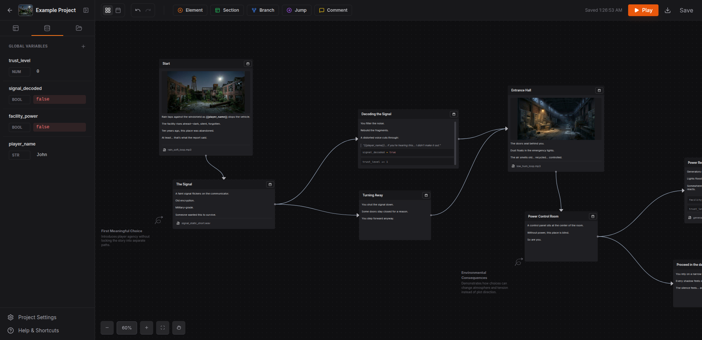

# NodeTale

A visual node-based story editor built with React and TypeScript. Create interactive branching narratives with variables, conditions, and rich text content using an intuitive drag-and-drop interface.



## Features

- **Visual Node Editor**: Drag-and-drop interface powered by ReactFlow for creating story flows
- **Rich Text Editing**: Inline editor with support for code blocks, variables, and formatting
- **Interactive Play Mode**: Runtime execution engine with condition evaluation and variable management
- **Project Persistence**: Automatic saving to IndexedDB with cross-board navigation
- **Asset Management**: Upload and manage images, audio, and video files
- **Variable System**: Typed variables (string, number, boolean, array, object) with project-wide scope
- **Branching Logic**: Condition nodes for dynamic story paths
- **Jump Nodes**: Cross-board navigation for complex narratives

## Tech Stack

- **Frontend**: React 19, TypeScript, Vite
- **UI Library**: ReactFlow (@xyflow/react), Tailwind CSS
- **Routing**: React Router 7
- **Runtime**: Bun
- **Persistence**: IndexedDB
- **Syntax Highlighting**: Prism.js
- **Icons**: Lucide React

## Quick Start

### Prerequisites

- [Bun](https://bun.sh/) runtime
- Node.js (for compatibility, though Bun is preferred)

### Installation

```bash
bun install
```

### Development

```bash
bun run dev
```

The app will start on `http://localhost:3000` with hot module replacement.

### Build

```bash
bun run build
```

### Preview

```bash
bun run preview
```

## Usage

1. **Create a Project**: Start from the dashboard by creating a new project
2. **Add Nodes**: Drag node types from the sidebar onto the canvas
3. **Connect Nodes**: Draw edges between nodes to define story flow
4. **Edit Content**: Double-click nodes to edit labels and rich text content
5. **Play Mode**: Switch to play mode to test your interactive story
6. **Manage Assets**: Upload media files through the asset panel
7. **Variables**: Define and manage story variables in the variables panel

### Node Types

- **Element Node**: Standard story content with rich text
- **Condition Node**: Branch based on variable conditions
- **Jump Node**: Teleport to other nodes (cross-board support)
- **Comment Node**: Non-interactive annotations
- **Section Node**: Visual grouping and dividers
- **Annotation Node**: Floating labels with directional arrows

## Contributing

We welcome contributions! Here's how you can help:

### Development Setup

1. Fork the repository
2. Clone your fork: `git clone https://github.com/Kartik-A-Patil/NodeTale.git`
3. Install dependencies: `bun install`
4. Start development server: `bun run dev`

### Guidelines

- **Code Style**: Follow TypeScript best practices and existing code patterns
- **Commits**: Use descriptive commit messages
- **Pull Requests**: 
  - Create a feature branch from `main`
  - Ensure tests pass (manual verification for now)
  - Update documentation if needed
  - Provide screenshots for UI changes

### Architecture Notes

- **State Management**: `useFlowLogic` for ReactFlow state, `useProjectState` for persistence
- **Data Model**: All types defined in `types.ts` - update this when adding new node properties
- **Persistence**: IndexedDB with auto-save on changes
- **Play Mode**: Runtime evaluation in `logicService.ts`

### Adding New Node Types

1. Create component in `components/nodes/YourNode.tsx`
2. Register in `flowConfig.ts`
3. Add drag handler in `useDragAndDrop.ts`
4. Update `NodeData` interface in `types.ts`

## Screenshots

Add screenshots to the `screenshots/` directory:

- Main editor interface
- Node canvas with connections
- Play mode execution
- Asset management panel
- Variable editor

## License

[GNU GENERAL PUBLIC LICENSE](LICENSE)


## Support

- [Issues](https://github.com/your-username/NodeTale/issues) - Report bugs and request features
- [Discussions](https://github.com/your-username/NodeTale/discussions) - Ask questions and share ideas

---
Built with ❤️ using modern web technologies.