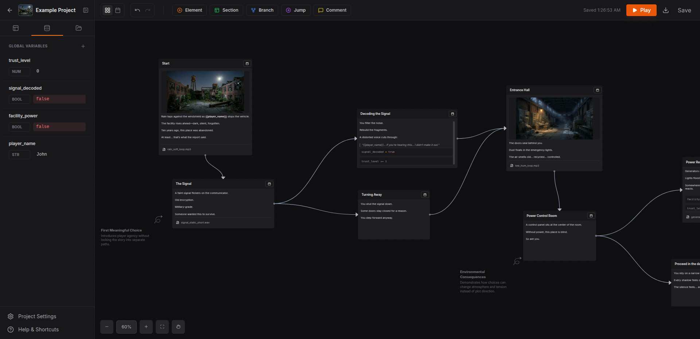

# NodeTale

A visual node-based story editor for creating interactive branching narratives. Available as both a web app and desktop application.



## Features

- **Visual Node Editor** – Drag-and-drop interface powered by ReactFlow
- **Rich Text Editing** – Inline editor with code blocks, variables, and formatting
- **Interactive Play Mode** – Runtime execution with condition evaluation
- **Asset Management** – Upload images, audio, and video files
- **Variable System** – Typed variables (string, number, boolean, array, object)
- **Branching Logic** – Condition nodes for dynamic story paths
- **Jump Nodes** – Cross-board navigation for complex narratives
- **Export/Import** – Package projects as `.nodetale` files

## Tech Stack

| Category | Technologies |
|---|---|
| **Frontend** | React 19, TypeScript, Vite |
| **Desktop** | Electron, electron-vite |
| **UI** | ReactFlow, Tailwind CSS, Lucide Icons |
| **Routing** | React Router 7 |
| **Storage** | IndexedDB (web), File System (desktop) |

## Quick Start

### Prerequisites

- [Bun](https://bun.sh/) or [Node.js](https://nodejs.org/) (v18+)

### Installation

```bash
bun install
```

### Development

```bash
# Web
bun run dev            # Start dev server at http://localhost:3000

# Electron
bun run dev:electron   # Start Electron dev mode
```

### Build

```bash
# Web
bun run build          # Production build to dist/

# Desktop
bun run dist:linux     # Linux AppImage
bun run dist:win       # Windows installer
bun run dist:mac       # macOS DMG
```

### Utility Commands

```bash
bun run clean          # Remove build artifacts (dist/, out/)
```

## Usage

1. **Create a Project** – Start from the dashboard
2. **Add Nodes** – Drag node types from the sidebar
3. **Connect Nodes** – Draw edges to define story flow
4. **Edit Content** – Double-click nodes for rich text editing
5. **Play Mode** – Test your interactive story
6. **Manage Assets** – Upload media through the asset panel

### Node Types

| Node | Purpose |
|---|---|
| Element | Story content with rich text |
| Condition | Branch based on variables |
| Jump | Navigate to other boards |
| Comment | Non-interactive annotations |
| Section | Visual grouping / dividers |
| Annotation | Floating directional labels |

## Project Structure

```
NodeTale/
├── src/                 # React application source
│   ├── components/      # UI components
│   ├── hooks/           # Custom React hooks
│   └── services/        # Storage & logic services
├── electron/            # Electron main/preload
├── configs/             # Build configurations
├── scripts/             # Build utilities
└── public/              # Static assets
```

## Contributing

1. Fork and clone: `git clone https://github.com/Kartik-A-Patil/NodeTale.git`
2. Install: `bun install`
3. Develop: `bun run dev`
4. Submit PRs to `main` branch

## License

[GNU General Public License v3.0](LICENSE)